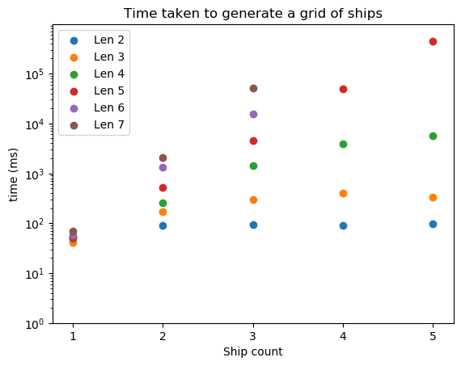

# Battleship!
(Best if ships have a distinct symbol, but doesn't break anything)

## Change log?
- Added command line args (i preffer the style of .json, but i agree it was quicker & simpler)
- Performance testing 
    


## Todo
- [x] decode `.json` to have `gameData.json` acting as universal settings, rather than hardcoding game states
- [x] encode each board as a Byte
    - [ ] Could that be generatable rather than making boards & converting?
    - [ ] fix the decoding error
    - [ ] the range thing
- [x] fix the copy issue ~~(or design a better way around it)~~
    - [ ] not have it save files as it coppies (work out what `deepCopy()` is actuall doing and not have it save the file names)
- [ ] Not a fan of how coords are being stored, would preffer cpp `pair` or py `tuple` style

## Encoding & Decoding the data:
For a game, the data needed is:
- board size
- ship data
    - x,y position
    - direction 
    - length

Since board size, and length are fixed for all games, this information is fixed in `gameSettings.json` (TODO, for now hardcoded)
- [ ] should export in the same order specified in command line args

The remaining data (x,y) and direction is encoded for each ship as follows:
position $p=x\times 10 + y$, then bitshifted left and final bit is the direction (`1` for horizontal $\rightarrow$)


## Ships know what?
There should be a way to distinguish which ship is which in the return value, such that once a ship is identified 

eg if it knows that '2' is in (0,2 and 0,3), then it can't be the second ship in this list

```
[. . 2 2 3 ]
[. . . . 3 ]
[. . . . 3 ]
[. . . . . ]
[. . . . . ]

[. . 3 3 3 ]
[. . . . 2 ]
[. . . . 2 ]
[. . . . . ]
[. . . . . ]
```


## links & things
[Data genetics battleship blog](http://www.datagenetics.com/blog/december32011/), 
[Yuval's Python notebook](https://colab.research.google.com/drive/1NlMnu8ftS8EpXtlaJMqdnYkbQQUpWEXm#scrollTo=q3jCF0oooxSv)


